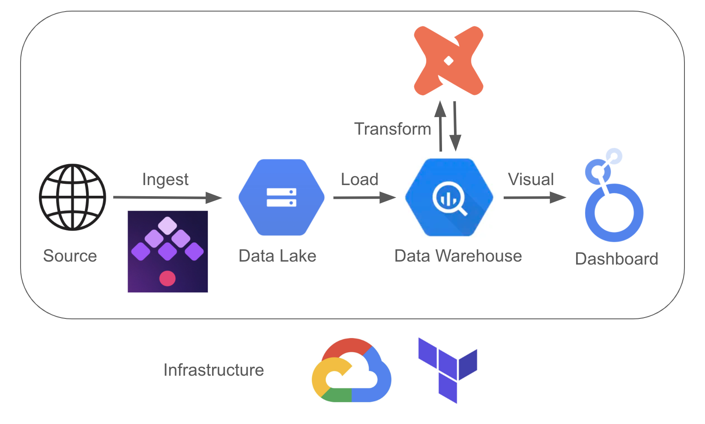
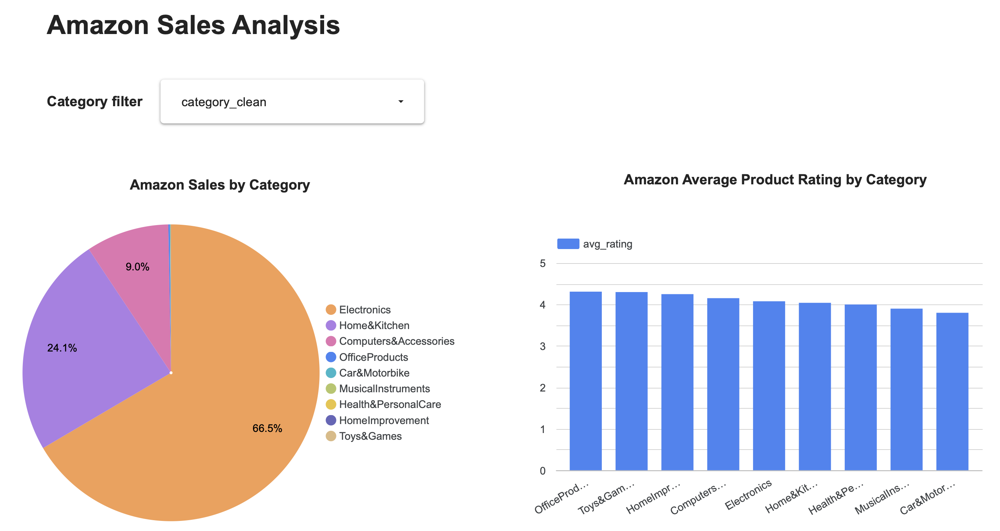

# Analysis of Amazon Sales Data

This project analyzes Amazon Sales data, including pricing and ratings, to show category-level insights. The goal is to build a scalable, cloud-based data pipeline that ingests, transforms, and visualizes e-commerce data. The final output is an interactive dashboard that helps understand product trends and customer preferences across different categories.

---

## 📌 Problem Description

E-commerce analysis plays a key role in understanding customer behavior and improving bussiness strategies in the competitive online market. As one of the biggest players, Amazon relies heavily on these insights. With thousands of products listed across a wide range of categories, it’s difficult to know which ones bring in the most revenue or get the best customer feedbacks. Effective analysis can help to transform massive raw data into actionable strategies. This project addresses that problem by:

- Cleaning and aggregating product-level data.
- Building a fully automated pipeline that processes raw product data and generates clean tables.
- Visualizing key insights in an interactive dashboard.

The final data pipeline and dashboard are fully reusable. They support ongoing product monitoring and can assist with business decision-making for e-commerce companies. The Amazon Sales dataset used in this project comes from [Kaggle](https://www.kaggle.com/datasets/karkavelrajaj/amazon-sales-dataset).

---

## ⚙️ Used Technologies

| Component         | Tool/Platform        |
|------------------|----------------------|
| Cloud Platform   | Google Cloud (GCP)   |
| IaC              | Terraform            |
| Batch Orchestration | Kestra         |
| Data Warehouse   | Google BigQuery             |
| Transformations   | DBT             |
| Visualization    | Google Looker Studio        |

---

## 🔄 Pipeline Overview

---

## 📊 Visualization

👉 [Dashboard Link](https://lookerstudio.google.com/reporting/5f70d065-0f8a-45a0-8bf6-fbf4fa6423be)
👉 [DBT dashboard link](https://xr623.us1.dbt.com/accounts/70471823429803/develop/70471823731216/docs/index.html#!/source_list/staging)

---

## 📁 Reproduction Guide

To reproduce this project in the cloud, follow the steps in [`REPRODUCE.md`](./REPRODUCE.md).

---

## 🧰 Folder Structure

* dbt: all documents and files for the data transformations in dbt
* images: images used in the repo
* kestra: files for setting up the kestra dag
* terraform: terraform files
