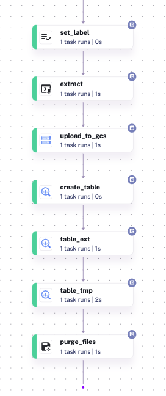

# Reproduce


---

## Setting up GCP VM 
---

### Set up ssh
In terminal, set up ssh keys.
```bash
cd .ssh/
ssh-keygen -t rsa -f ~/.ssh/KEY_FILENAME -C USERNAME
cat gcp.pub
```
Copy the public keys. Go to "Compute Engine -> Matadata -> SSH keys". Add SSH keys.
Go to "Compute Enine -> VM instances". Create an instance and copy the external IP. Then create a config folder for ssh.
```bash
ssh -i ~/.ssh/gcp [username]@[external IP]
cd .ssh/
touch config
code config # Open visual studio code
```
The config file should look as following.
```bash
Host [name, for example de-zoomcamp]
  Hostname [external IP address]
  User [username]
  IndentityFile [path to the .ssh/gcp file]
```

### Set up remote-ssh in visual studio code
Install Remote-SSH
Select "Connect to Host"

### Install Anaconda
Search for Anaconda installers. Download for Linux system. 
After it is downloaded and installed, run the initializer. You should be able to find Anaconda at the end of the .bashrc file.
```bash
less .bashrc
```

### Install Docker
```bash
sudo apt-get update
sudo apt-get install docker.io
```
Give docker permission.
```bash
sudo gpasswd -a $USER docker
sudo service docker restart
```
Log out and log in. Docker should be able to run successfully.

Then, install [docker-compose](https://github.com/docker/compose/releases). Download the most recent version for linux. 
```bash
docker run -it ubuntu bash
mkdir bin
cd bin/ # download docker compose in this folder
wget # link
chmod +x docker-compose
./docker-compose version # this indicates the download is successful
nano .bashrc
```
Add the setup to the end of the .bashrc file.
```bash
export PATH="${HOME}/bin:${PATH}"
```
Save the file. 
```bash
source .bashrc
```

### Install pgcli
```bash
conda install -c conda-forge pgcli
pip install -U mycli
```

### Install terraform
```bash
cd bin/
wget # terraform download link
unzip # unzip if necessary
```

## Set up a service account
---

* Go to IAM & Admin to create a service account.
* Give following premissions:
  * Storage admin
  * BigQuery admin
* Create and download a new JSON key. That will be the google credential used in terraform and kestra. 


## Use Kestra to ingest data
---

* Create the [docker-compose file](https://github.com/Jingyuan805/Amazon-Sales-DE-Zoomcamp2025/blob/main/kestra/docker-compose.yml)
```bash
docker-compose up -d
```
* Create the [.yaml files](https://github.com/Jingyuan805/Amazon-Sales-DE-Zoomcamp2025/tree/main/kestra/flows) to ingest data.
* Add key-values in Kestra. Recommended key values are fcp_creds, gcp_project_id, gcp_location, gcp_bucket_name, gcp_dataset. They can be set up by code (gcp_kv file). For the sake of safety, I didn't include gcp_kv file in the folder.
* Key values are now variables. They can be referenced in other files.
* Execute all .yaml files to ingest data to GCS.
  * Note that when creating tables, make sure all data columns have defined data types.
  * Simple data cleaning can be done in this step. For example, the price columns have dollar symbol, so I remove them and only keep numbers.
* The final dag should look like this.
  


## Generate a cluster table in BigQuery
---

* Read data from GCS and create a cluster table.
```sql
-- Creating external table referring to gcs path
CREATE OR REPLACE EXTERNAL TABLE `[project_nmae].[schema].[table_name_ext]`
OPTIONS (
  format = 'CSV',
  uris = ['gs://xxx.csv'] # gcs path
);

-- Creating a cluster table
CREATE OR REPLACE TABLE [project_nmae].[schema].[table_name]
CLUSTER BY [column_name] AS
SELECT * FROM [project_nmae].[schema].[table_name_ext];
```

## Set up DBT
---

### Build the DBT model

* Set up DBT cloud with bigquery and connect to a github repo. Detailed instructions can be found [here](https://github.com/DataTalksClub/data-engineering-zoomcamp/blob/main/04-analytics-engineering/dbt_cloud_setup.md).
* Got to Cloud IDE. Create a branch and initialize the project.
* Update dbt.project.yml. Change project names, etc.
* Go to "models". For schema.yml files, update variables to fit the dataset. Update .sql files to change the model if necessary.
* Use dbt build to run the model.
* Everything should be successful. Final document should be similar to [this](https://xr623.us1.dbt.com/accounts/70471823429803/develop/70471823731440/docs/index.html#!/overview). 

### Deployment

* Create a new environment. Set deployment type as "production".
* Create a deploy job use "production" environment.
* Set the running time as needed. 


## Use Looker Studio
---

* Go to Looker studio.
* Create a new visualization using the table from Bigquery.
